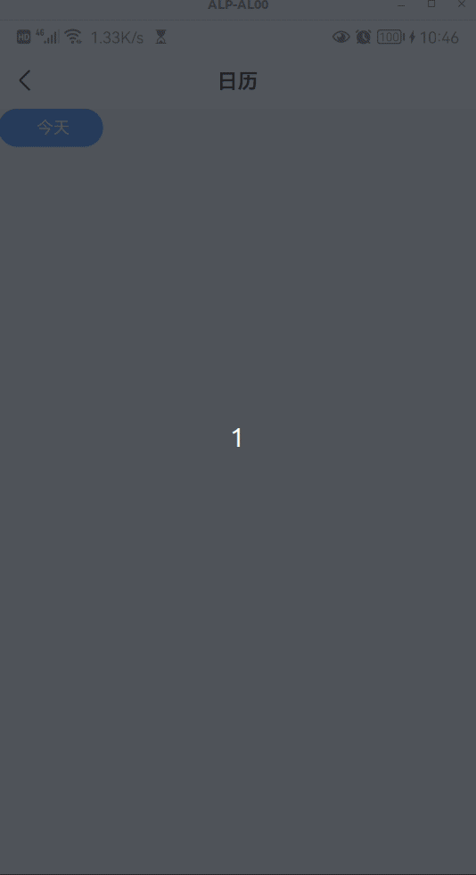

# mz-calendar

> 依赖 dayjs； 依赖弹层组件 `mz-popup`，可实现弹出式的日历滚动展示和简单交互

## Demo



## 基本用法

```vue
<template>
  <mz-calendar :monthSpan="4" @checked="dayChecked" />
</template>

<script>
  import { MzCalendar } from 'mz-weex-ui';
  export default {
  	components: { MzCalendar },
  	methods: {
        dayChecked(day) {
            this.$toast(day.format('MM-DD'));
        },
    },
  }
</script>
```


### 可配置参数

| Prop | Type | Required | Default | Description |
|------|------|----------|---------|-------------|
| showCalendar | `Boolean` |`Yes`| `false` | 是否显示  |
| pos | `"bottom|free"` |`No`| `'bottom'` | 从哪弹出  |
| popupHeight | `Number` |`No`| `520` | 弹层高度，ipx下自动增加68px |
| monthSpan | `Number` |`No`| `3` | 月份跨度  |
| popupStyle | `Object` |`No`| - | 弹层样式  |
| normalDayStyle | `Object` |`No`| - | 普通日期样式  |
| todayStyle | `Object` |`No`| - | “今天”的日期数字样式  |
| todayTextStyle | `Object` |`No`| - | “今天”的下标文字样式  |
| checkedStyle | `Object` |`No`| - | 选中日期样式  |
| disabledStyle | `Object` |`No`| - | 禁用日期样式（月份跨度之外的日期，以及`disabledList`中的日期）  |
| emphasizedStyle | `Object` |`No`| - | 突出日期样式  |
| monthStyle | `Object` |`No`| - | 月份文字样式（与日期显示于同一容器中）  |
| weekStyle | `Object` |`No`| - | 星期文字样式 |
| titleStyle | `Object` |`No`| - | 标题文字样式，`titleText`非空时可用 |
| titleText | `String` |`日历`| - | 标题文字内容 |
| disabledList | `Array` |`No`| - | 须禁用的日期列表，支持dayjs格式，或可被格式化为日期类型的字符串格式  |
| emphasizedList | `Array` |`No`| - | 须突出显示的日期列表，支持dayjs格式，或可被格式化为日期类型的字符串格式  |
| scrollToDay | `String` |`No`| today.format("YYYY-MM-DD") | 打开时自动滚动到的日期 |
| overlayCfg | `Object` |`No`| - | 遮罩层配置，用于覆盖默认配置 |
| boxShadow | `Boolean \| String` |`No`| `true` | 弹层下是否显示投影，可转入自定义投影样式 |


### 事件

- 日期被选中时触发

```
@checked="dayChecked"
```
