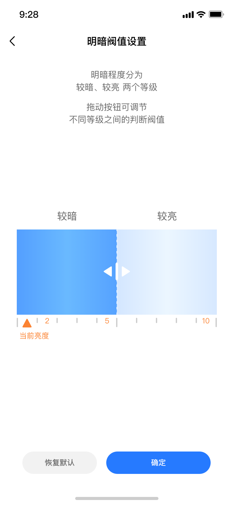

# mz-illumination-bar

> 明暗亮度档位选择组件

### 规则
- 用于选择明暗亮度档位


## Demo

## 使用方法

```vue
<template>
    <mz-illumination-bar
        :index="curIndex"
        :envIndex="curEnvIndex"
        @updateValue="onUpdateValue"
        @slideEnd="onSlideEnd"
    ></mz-illumination-bar>
</template>
<script>
  import { MzIlluminationBar } from 'mz-weex-ui';
  export default {
  	components: { MzIlluminationBar },
  	data: () => ({
            curIndex: 4,
            curEnvIndex: 0,
  	}),
        methods: {
            onUpdateValue(e) {},
            onSlideEnd(e) {}
        }
  }
</script>
```


### 可配置参数

| Prop | Type | Required | Default | Description |
|-------------|------------|--------|-----|-----|
| index       | `Number` |`N`| `4`    | 拖动栏当前值 |
| envIndex       | `Number` |`N`| `1`      | “当前亮度”指示器当前值(取值从1~10) |

### 事件

- 滑动时候的值更新

```
@updateValue="onUpdateValue"
```

- 滑动结束时触发

```
@slideEnd="onSlideEnd"
```
