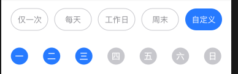

# mz-link-list

> 横向标签列表,超出屏幕可滑动





## 使用方法

```vue
<template>
  <div class="mz-demo">
    <LinkList :list="btnList" :itemStyle="{ minWidth: '120px' }"></LinkList>
  </div>
</template>

<script>
  import { mzLinkList } from 'mz-weex-ui'
  export default {
    components: { mzLinkList },
    data: () => ({
       btnList: [
              { name: '仅一次', checked: false },
              { name: '工作日', checked: false },
              { name: '周末', checked: false },
              { name: '每天', checked: false },
              { name: '自定义', checked: false }
            ],
    }),
  }
</script>
```

### Props

| 参数 | 说明 | 类型 | 默认值 |
| ---- | :----------:|:----:|:-------:|
| list |列表数据| `Array` | `[]` |
| itemStyle | 按钮元素样式配置对象 | `Object` | `{}`
| itemCheckedStyle | 按钮元素选中样式配置对象 | `Object` | `{}`

#### list数据结构
| Prop | Description | Type | Default |
| ---- | :----------:|:----:|:-------:|
| name | 按钮名称 | `String` | `` |
| checked | 是否选中状态 | `Boolean` | `` |

### Events
| 事件名 | 说明 | 回调参数
| ---- |:----:|:---:|
| change | 标签选中状态改变触发 | data,列表子数据 |
