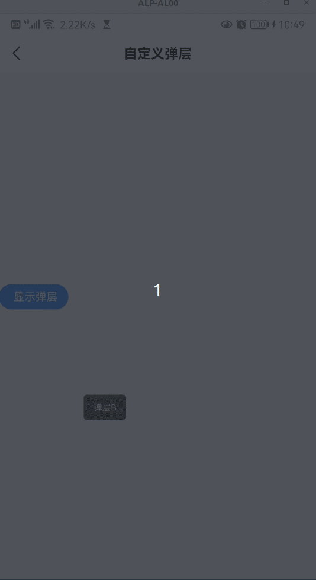

# mz-popup

> 弹层，区别于 dof-popup，可自定义弹出的位置和样式

## Demo



## 基本用法

```vue
<template>
  <mz-popup
      :show="show"
      @overlayClicked="show = false"
      @buttonClicked="show = !show"
    >
      <text class="popup-text">默认 slot 弹层内容</text>
  </mz-popup>
</template>

<script>
  import { MzPopup } from 'mz-weex-ui';
  export default {
  	components: { MzPopup },
  	data: () => ({
      show: false
  	});
  }
</script>
```


### 可配置参数

| Prop | Type | Required | Default | Description |
|------|------|----------|---------|-------------|
| show | `Boolean` |`Yes`| `false` | 弹层显示状态  |
| pos | `"bottom|free"` |`No`| `free` | 从哪弹出  |
| btnText | `String` |`No`| `显示弹层` | 触发按钮文字 |
| haveOverlay | `Boolean` |`No`| `true` | 是否带有遮罩屏蔽 |
| overlayCfg | `Object` |`No`| - | 遮罩层配置，用于覆盖默认配置 |
| boxShadow | `Boolean \| String` |`No`| `true` | 弹层下是否显示投影，可转入自定义投影样式 |
| popupHeight | `Number` |`No`| `500` | 弹层高度 |
| popupStyle | `Object` |`No`| - | 覆盖弹层样式，包括尺寸、位置、背景 |
| animation | `Object` |`No`| `timingFunction: 'cubic-bezier(0.25, 0.1, 0.25, 1.0)'` | 弹层动画时间函数 |


### 事件

- 按钮被点击时触发，一般用于显示/关闭弹层；首次触发时会基于 `domModule` 计算按钮的位置

```
@buttonClicked="buttonClicked"
```

- 遮罩层被点击时触发； 弹层显示状态才可能被触发

```
@overlayClicked="overlayClicked"
```

- 弹层背景被点击时触发；若弹层覆盖在按钮之上，则改为触发 `@buttonClicked`

```
@popupClicked="popupClicked"
```

### Slot
- 匿名插槽，可在 `mz-popup` 标签内直接使用；
```vue
<slot></slot>
```

- 触发按钮插槽。trigger 默认是 `dof-button`，能暴露的参数有限，需要定义的东西多的话，就直接通过插槽实现吧，详见 example
```vue
<slot name="trigger"></slot>
```