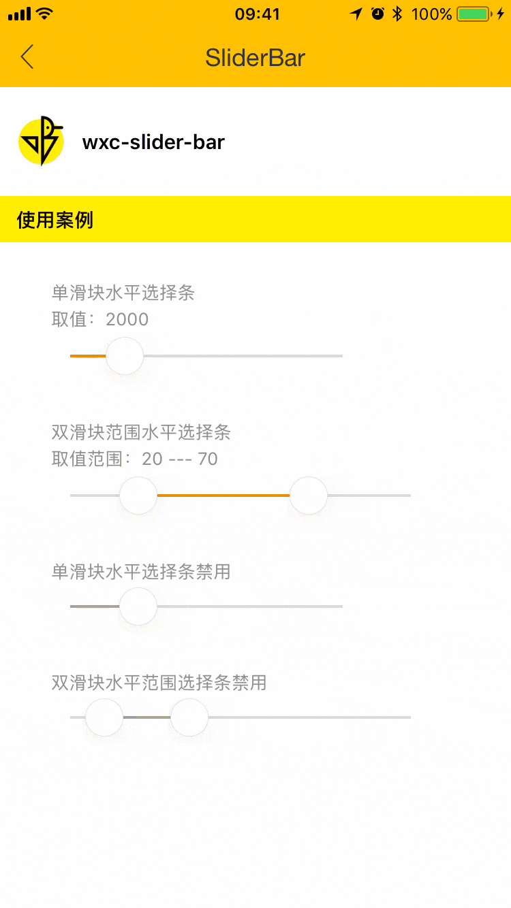

# mz-slider-bar 

> 滑动选择组件（文档待完善）

### 规则
- 用于选择线性取值范围中某个具体的值（整数），或者选取一个取值范围


## Demo

## 使用方法

```vue
<template>
  <mz-slider-bar v-bind="sliderBarCfg"></mz-slider-bar>
</template>
<script>
  import { MzSliderBar } from 'mz-weex-ui';
  export default {
  	components: { MzSliderBar },
  	data: () => ({
      sliderBarCfg: {
        length: 400,
        range: false,
        min: 0,
        max: 100,
        value: 50,
        defaultValue: 50,
        disabled: false
      }
  	});
  }
</script>
```


### 可配置参数

| Prop | Type | Required | Default | Description |
|-------------|------------|--------|-----|-----|
| length       | `Number` |`N`| `500`    | 滑条长度 |
| height       | `Number` |`N`| `4`      | 滑条高度 |
| range        | `Boolean` |`N`| `false`  | 是否选择范围 |
| min          | `Number` |`N`| `0`      | 滑条最小值 |
| max          | `Number` |`N`| `100`    | 滑条最大值 |
| minDiff      | `Number` |`N`| `5`      | 选择范围时最小差值（用于避免按钮重合） |
| value        | `[Number, Array]` |`N`| `0` | 设置当前取值|
| defaultValue | `[Number, Array]` |`N`| `0` | 设置初始取值|
| disabled     | `Boolean` |`N`| `false`  | 是否禁用 |
| invalidColor | `String` |`N`| `#E0E0E0`| 无效颜色 |
| validColor   | `[Number, Array]` |`N`| `#EE9900`| 有效颜色，若为数组时，滑动条颜色则为渐变色（仅支持2个颜色的渐变） |
| disabledColor| `String` |`N`| `#AAA`   | 禁用颜色 |
| selectRange  | `Array` |`N`| `[0, 0]`   | 回传值 |
| blockColor  | `String` |`N`| `#FFFFFF`   |滑块颜色|
| pointHeight  | `Number` |`N`| `40`   |滑块高度|

### 事件

- 滑动时候的值更新

```
@updateValue="updateValue"
```

- 滑动停止时候回传指

```
@wxcSliderBarTouchEnd="wxcSliderBarTouchEnd"
```
