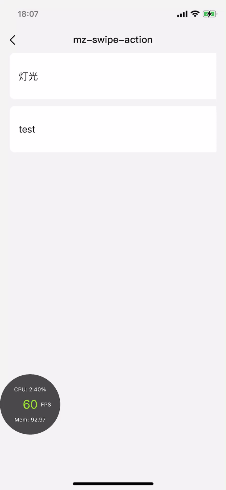

# mz-swipe-action

> 侧滑列表,支持插槽





## 使用方法

```vue
<template>
  <div class="mz-demo">
    <mz-swipe-action
          ref="scenePaneSwipe"
          @dofRightClicked="cellMenuClick"
          width="686px"
          :itemStyle="{ marginBottom: '24px', borderRadius: '16px' }"
          :list-data="list"
        >
          <template slot="swipeItem" slot-scope="scope">
            <div class="list-item">
              <div class="item-left">
                <text class="item-name">{{scope.data.deviceName}}</text>
              </div>
            </div>
          </template>
        </mz-swipe-action>
  </div>
</template>

<script>
  import { MzSwipeAction } from 'mz-weex-ui'
  export default {
    components: { MzSwipeAction },
    data: () => ({
      list: [
              {
                deviceName: '灯光',
                rightItem: [
                  {text: '编辑', bgColor: '#4fa7ff'},
                  {text: '删除', bgColor: '#FF3B30'}]
              },
              {
                deviceName: 'test',
                rightItem: [{text: '删除', bgColor: '#FF3B30'}]
              }
            ]
    }),
    methods: {
      //e.index，e.i，e.text 当前列表索引，当前点击的侧滑选项索引，当前点击的侧滑选项文本
            async cellMenuClick (e) {
              modal.toast({
                message: JSON.stringify(e),
                duration: 0.3
              })
            },
    }
  }
</script>
```

### Props

| 参数 | 说明 | 类型 | 默认值 |
| ---- | :----------:|:----:|:-------:|
| width | 滑动列表元素宽度 | `String` | `750px` |
| listData |侧滑列表数据| `Array` | `[]` |
| itemStyle | 滑动项元素样式配置对象 | `Object` | `{}`
| disableSwipe | 临时禁用滑动功能 | `Boolean` | `false`

#### listData数据结构
| Prop | Description | Type | Default |
| ---- | :----------:|:----:|:-------:|
| rightItem | 侧滑按钮数组,数据结构： {text: 按钮文案, bgColor: 按钮颜色 } | `Array` | `[]` |

### Events
| 事件名 | 说明 | 回调参数
| ---- |:----:|:---:|
| cellMenuClick | 点击侧滑按钮时触发 | { index: 当前点击的侧滑选项索引, text: 当前点击的侧滑选项文本 } |
